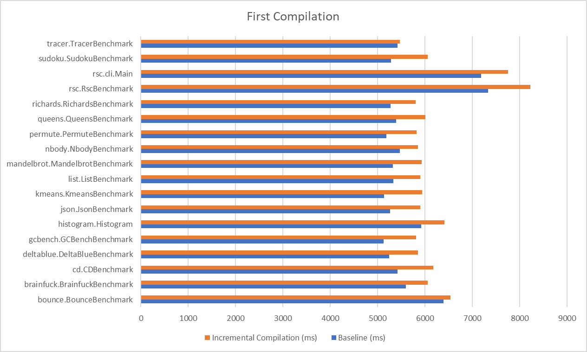
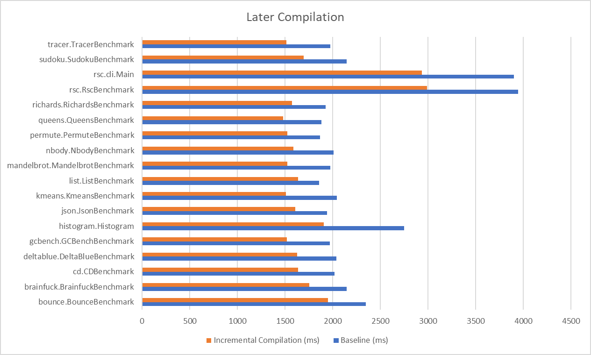
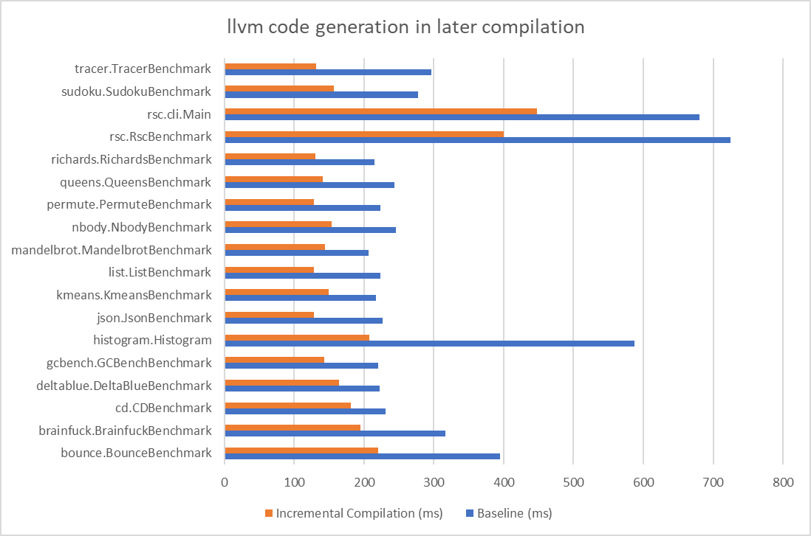
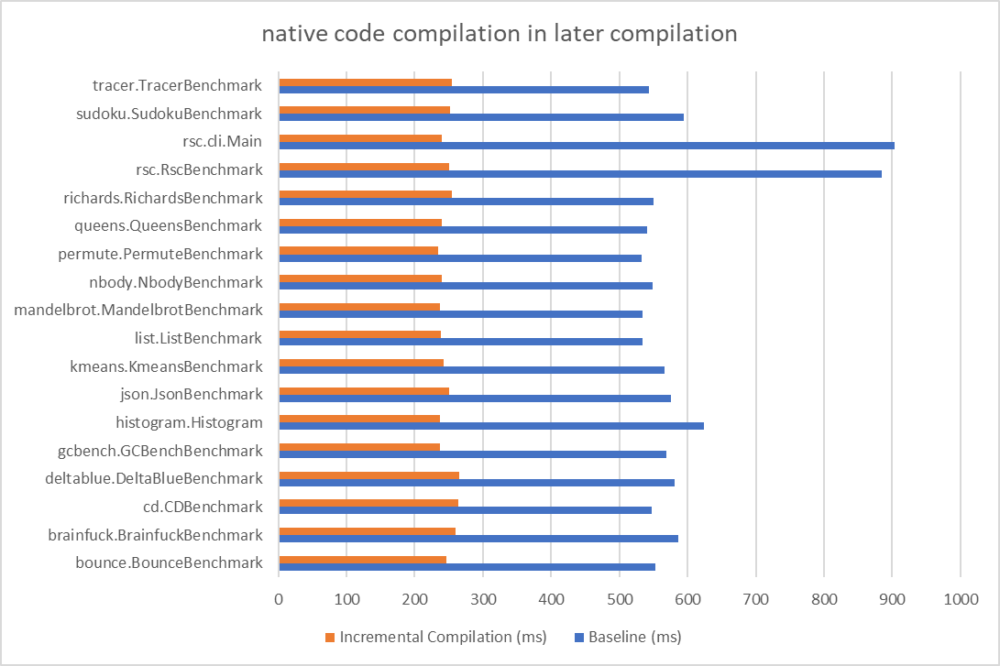

# Optimization of Scala Native linker

## 1. Introduction

My topic of the GSoC project is Optimization of Scala Native linker. I am very thankful for my mentor Wojciech Mazur during the GSoC period. He is very patient and always gave me precious advices. It is impossible for me to achieve these results without his help. 

Scala Native is an optimizing ahead-of-time compiler and runtime for scala. Traditional Scala code is compiled to JVM-interpretable bytecode, while Scala Native directly compiles scala code to binaries. Here are two main steps in Scala Native to compile the scala code to binaries: first the scala code is compiled to the traditional bytecode and `NIR`(Native Intermediate Representation) by dedicated testing compiler plugin; second `NIR` code is loaded, optimized, and transformed to `IIVM-IR` code by Scala Native Linker. During the GSoC period, my task was to investigate how to speed up Scala Native Linker. Here are four products in my project:

* Build benchmarks for evaluating the performance of Scala Native, and create an automatic test script to measure the compilation and runtime performance: [scala-native-autotest](https://github.com/yuly16/scala-native-autotest)

* Introduce incremental compilation to Scala Native, which reduces the build time by 21% on average: [Incremental Compilation PR link](https://github.com/scala-native/scala-native/pull/2777). Currently all works are done, and it will be merged within one week. 

* Profile the optimizer of Scala Native. Based on the profile result, we decrease the memory cost and fix the issue that Scala Native is stuck when compiling very large projects on release mode: [Profiling optimizer PR link](https://github.com/scala-native/scala-native/pull/2819) Currently all works are done, and now we are improving the code quality to make it easier to read. It will be merged within one week. 

* Investigate the feasibility of parallel optimization. The conclusion is that parallel optimization is nontrivial to implement in the current Scala Native optimizer. Finally, we will give some possible solutions to do parallel optimization in the future.

* Other fixes of Scala Native, which has described in the last section.
# 2. Scala Native Benchmark Evaluation

## 2.1 Introduction to Scala Native Autotest

[Scala Native Autotest](https://github.com/yuly16/scala-native-autotest) is the tool we created to automatically test the performance of Scala Native. The usage of the script is:

```
./autotest --scala SCALA-VERSION --scala-native SCALA-NATIVE-VERSION --benchmark-list <benchmarks list or non to run all>
```

And then the compilation and runtime time cost is collected in a csv file, which makes it easier to analyze our changes to Scala Native. 

The scala code benchmark contains 18 scala projects referred from the [original Scala Native Benchmarks](https://github.com/scala-native/scala-native-benchmarks). The benchmark is listed below:

```
[1] bounce.BounceBenchmark
[2] brainfuck.BrainfuckBenchmark
[3] cd.CDBenchmark
[4] deltablue.DeltaBlueBenchmark
[5] gcbench.GCBenchBenchmark
[6] histogram.Histogram
[7] json.JsonBenchmark
[8] kmeans.KmeansBenchmark
[9] list.ListBenchmark
[10] mandelbrot.MandelbrotBenchmark
[11] nbody.NbodyBenchmark
[12] permute.PermuteBenchmark
[13] queens.QueensBenchmark
[14] richards.RichardsBenchmark
[15] rsc.RscBenchmark
[16] rsc.cli.Main
[17] sudoku.SudokuBenchmark
[18] tracer.TracerBenchmark
```

The workflow of compiling each benchmark project is:

* Warm up sbt: clean the project and compile it
* Calculate the time cost of the first compilation: clean the project and compile it. 
* Calculate the time cost of the second compilation: we change a line in the project. This time we don't clean the project, and just recompile it. 
* After compiling all benchmark projects, we test the time cost of binaries they produce. 

The autotest script is used to test the performance of incremental compilation, which we will discuss below. 

## 2.2 Implementation
This section is helpful if anyone would like to debug or modify the autotest script. We write a `build.sbt` template in the `template` directory. This template does sbt warm-up and two compilations for every project that needs to test. However, the template can not be executed by sbt directly, since we set some placeholders in it. The `autotest` script replaces placeholders to input parameters, for example, the current Scala version, Scala Native version, and benchmarks that need to test. `generate_csv.py` collects the compilation output and generates a report about the performance of Scala native. 

# 3. Incremental Compilation
Incremental compilation is the technique that accelerates the compilation if there are few changes between two compilations in a project. Generally, when developing software, programmers follow edit-compile-run cycles: we change some source codes in the program, compile and execute it to see runtime results, and then repeat the steps above until we get the expected output. incremental compilation is based on a straightforward idea: we don't need to recompile the whole project if changes in edit phase are few. Instead, we only recompile the changed libraries or packages, which would notably decrease the compilation time. 

A non-trivial topic in the incremental compilation is how to detect the change in the code. One simple method is to record the hash code of each file and compare them with file hash codes in the last compilation. However, this method doesn't work in Scala Native. The reason is that Scala Native skips the unused code in the linking phase. Here is a case: the package `A` is not changed between two compilations, but a function `foo` in the package `A` is used in the second compilation. If `foo` is not used in the first compilation, we have to recompile package `A`, because `foo` is omitted by Scala Native Linker in the first compilation. 

Therefore, we collect the hash code of each definition after loading and optimizing `NIR` code. We compare hash codes with the previous compilation and select definitions that are changed. Fortunately, the definitions in Scala Native are represented by case class or case object, which makes it easier to compute the hash code, since the hash code of case class or case object in Scala remains the same in different executions. 

Another important factor is the granularity of the incremental compilation. Initially, we set the granularity as class and generate one `IIVM-IR` file for each class. A `IIVM-IR` file should be recompiled if its corresponding class has changed definitions. However, it introduces high overheads on the first compilation, since a project usually has hundreds or even thousands of classes, so we have to compile hundreds or thousands of `IIVM-IR` files in the first compilation. Therefore, we set the granularity as package, which introduces negligible overheads on the first compilation, and has remarkable improvement on later compilations. 

We test the performance of incremental compilation on the Scala Native benchmark that we discussed in the second section. The baseline is the original Scala Native version. All experiments are done in debug mode because incremental compilation is mainly used in debug mode. First, we compare the time cost of the first compilation between incremental compilation and baseline, and then change a line in the project and compare the time cost of the second compilation. 

The comparison in the first compilation: 


The blue line is the time cost of baseline, and the orange line is the time cost of incremental compilation. The overhead in the incremental compilation is caused by generating more `IIVM-IR` files than the baseline. The number of `IIVM-IR` files in baseline equals to the number of CPU cores, while the number in the incremental compilation version equals the number of packages in the project. 

The comparison in the later compilations: 


The average improvement of incremental compilation is 21%, which has already surpassed 20%, the expected result in my GSoC proposal. 

The steps that Scala Native Linker compiles `NIR` is: 
* Link `NIR` file and reach all used `NIR` classes and definitions
* Optimize `NIR` definitions
* Generate `IIVM-IR` code(`.ll` file)
* Compile native code(`.ll.o` file)
* Link native code

incremental compilation decreases the time of generating `IIVM-IR` code and compiling native code because we only need to compile `.ll` and `.ll.o` files that are changed. 

In the later compilations, the comparison of time cost of llvm code generation is:



And the comparison of time cost of native code compilation is:



Overall, the incremental compilation is a powerful technique that improves the performance of Scala Native by 21%. The push request can be seen [here](https://github.com/scala-native/scala-native/pull/2777).

# 3. Scala Native Optimizer Profile
Interflow is the interprocedural and flow-sensitive optimizer in Scala Native. We design a separate `NIR` optimizer in Scala Native because `IIVM-IR` doesn't support object-oriented features, so the LLVM optimizer is not fittable for the optimization of `NIR`.  The Interflow optimizer supports several optimizations, such as flow-sensitive type inference, inline and method duplication, etc. 

Generally, `NIR` code optimization in release mode is the most time-consuming part of Scala Native. We notice that compiling some large Scala projects, for example, [scalafmt](https://github.com/tgodzik/scalafmt) is stuck in the optimization phase. The branch `add-scala-native` in this repository supports Scala Native Compilation, but the original Scala Native occurs out of heap memory during the optimization phase in release mode, no matter how large heap size we set. Therefore, profiling Scala Native is needed to find out why this project is stuck. 

Initially, we used `VisualVM` to profile Scala Native Linker, but then we found it is not a practical way. Scala Native reaches fifty thousand methods in `scalafmt`, which is already an extremely high burden for the Interflow optimizer. `visualvm` injects code to `scalafmt`, which further introduces numerous memory and computation cost. Usually, the profiling runs a whole day without any useful information until it exhausts all system resources. 

Instead of using `visualvm`, adding logs is a feasible solution. Two issues emerge after analyzing logs in the critical paths of the Interflow optimizer. 

The first problem is that the `todo` queue in the Interflow optimizer explodes. Scala Native makes sure that each definition is only optimized once. When the optimizer reaches a definition, it would push it to the `todo` queue no matter whether this definition has ever been optimized or not. The optimizer pops a definition from `todo` queue and checks if the definition has been optimized. If yes, this element in the queue would be discarded. Now here is a potential issue: the `todo` queue might exists duplicate elements. In `scalafmt` project, sometimes the length of `todo` queue is hundreds of millions, even if there are only fifty thousand methods. The numerous elements in `todo` queue occupy most of the heap and cause the out-of-memory error. Therefore, the first fix is to add a check before pushing it to `todo` queue: if this definition is already in `todo` queue or has ever been optimized, just omit it. 

Unfortunately, this fix is not enough to make `scalafmt` pass the optimization phase. The fact is that `scalafmt` is still stuck in the optimization phase for several hours and finally causes the out-of-memory error. By analyzing logs in the optimization phase, we found that inline takes most of the time. Inline is an effective technique in Scala Native to decrease the overhead of function calls. In debug mode, the inline is disabled; while in release mode, we use inline and method duplication. When a function call is reached, we will check if this function call can be inlined. In `releaseFull` mode, a function call should be inlined in the following conditions:

* The function is a class constructor
* The size of the function is small
* The function has `inline` specifier
* The type of arguments of the function is `virtual`

The last point is a significant concept in the Interflow optimizer. Some operators such as `Classalloc`, `Arrayalloc`, and `box` allocate memory on the heap. The Interflow optimizer would delay their memory allocation until their allocated elements are used or would escape a local scope. In this way, the unused instances of the class are removed. However, if the method call has virtual arguments, the arguments are forced to be materialized when passing to the invoked function, which might lose some performance. Therefore, we can delay the materialization of the arguments by inlining the function call. 

The culprit of being stuck in the optimization phase is the nested inline. The Interflow optimizer uses a merge processor to optimize a function. If a function is visited for the first time, it would be pushed to the merge processor; if the function `foo` is inlined by other functions, it should also be pushed to the merge processor. For example, the function `foo` invokes function `bar`. Whether `foo` should inline `bar` is decided by the arguments of `foo`. Therefore pushing inlined function `foo` to the merge processor is necessary. 

Because the inlined function should also inline all its function calls, the number of inlining grows exponentially when the project size increases. We notice that it is very common that a function is inlined thousands of times in in `scalafmt` project. What's worse is that different argument values or argument types decide how the function call is inlined, thus we don't know what the inlined function looks like until we push it to merge processor and get the result. 

Therefore, a feasible solution is to limit the inline depth and caller/callee size. We stop inlining if the inline depth or caller/callee size is larger than a threshold. The compilation of `scalafmt` can be finished if limiting the inline depth to 5. The push request is [here](https://github.com/scala-native/scala-native/pull/2819).


# 4. Investigating the feasibility of parallel optimization

Currently, Interflow is a single-pass whole-program optimizer. It optimizes the program starting from the program entries and traverses the whole program. In debug mode, since we don't do inline and method duplication, it is easy to implement parallel optimization. However, in release mode, the context of a function determines how the function is optimized. For example, the argument of the function determines how the function does inline with its function call. These properties of inline make it tricky to parallelize. In this task, we exploit the feasibility to do parallel optimization on release mode. 

First, we refer [Parallel Incremental Whole-Program Optimizations for Scala.js](https://lampwww.epfl.ch/~doeraene/publications/oopsla16-incremental-optimizer.pdf) to build a dependency graph. Initially, we set the node of the dependency graph as method: if a method `foo` calls another method `bar`, the node `foo` points to all method `bar` in the current class and all subclasses because we don't know which `bar` is called at runtime. When doing the optimization, `foo` has to wait until `bar` is optimized, since the optimization of `foo` relies on the optimization of  `bar`. 

After building the dependency graph, we can theoretically do the parallel optimization by parallelizing the independent nodes. However, there are two issues that we have to fix:

First, if the number of methods is large (it is very possible in a large project), the complexity of iterating the dependency graph is extremely high. Here are two ways to decrease the complexity:


* Do an extra one-pass optimization in debug mode, while in this pass we do no optimization. We just process the whole program and build the dependency graph. We test this method in the Scala Native benchmark. The overhead of building the dependency graph is within 300ms, which is acceptable compared to nearly 10s of release mode optimization. 
* Set the granularity of the dependency graph as class

The drawback of the first method is that we can't build a precise dependency graph. Because of inline and method duplication, the function calls in release mode are different from those in debug mode. Therefore, we would lose some runtime performance.

The second method is more feasible for Scala Native. Even if it decreases the degree of parallelism, it makes the time cost of iterating the dependency graph negligible. Unfortunately, to implement this method, we have to change most of the interflow logic in Scala Native. It is too difficult to rewrite interflow during the period of GSoC since the interflow optimizer is the most complicated component in Scala Native.

But the main reason we didn't implement the second method is that we fail to design a parallel optimization algorithm to produce the exact same binary among different executions. Here is a simple case: `A` calls `B`, `C` calls `D`, `B` and `D` call each other. If we first visit `A`, `A` would inline `B` and `B` would inline `D`. To avoid the dead loop, when we visit `D`, `D` would abandon inlining `B`. However, if we visit `D` first, `D` would inline `B` and `B` would abandon inlining `D`. The two executions produce different binaries, which makes our incremental compilation impossible to work. It makes sense only when the improvement of parallel optimization exceeds the incremental compilation. Unfortunately, incremental compilation can decrease nearly half of the compilation time in release mode, which requires that the parallel optimization should be extremely efficient to counteract the loss of not using incremental compilation.

In summary, if we would like to implement parallel optimization in the future, we can focus on two main points: first, set the granularity of the dependency graph as class and change the workflow of the Interflow optimizer; second, design a parallel optimization algorithm to produce a stable binary. 


# 5. Other contributions

## 5.1 Simplify `CollectLocalValDeps` and `Lower.Impl`
I found that `CollectLocalValDeps` and `Lower.Impl` extend transform. However, the function `onType` in transform does nothing. Therefore we can add `override def onType(ty: Type): Type = ty` in the two classes to avoid unnecessary calculations. The push request link is [here](https://github.com/scala-native/scala-native/pull/2772). This work has been merged to Scala Native. 

## 5.2 Add `SortedSet` in MergeProcessor

In the function `advance` in `MergeProcessor`, we change the type of `todo` to `SortedSet`, which makes the code cleaner and avoids transforming `todo` to array and sorting it when executing advance as the previous version. The push request link is [here](https://github.com/scala-native/scala-native/pull/2819). All work is done and it will be merged within a week. 

## 6. Future work

The future work is to implement parallel optimization based on our investigation. Changing the logic of the interflow optimizer is necessary. It is a quite difficult task, but I believe it will bring the huge improvement on Scala Native. 